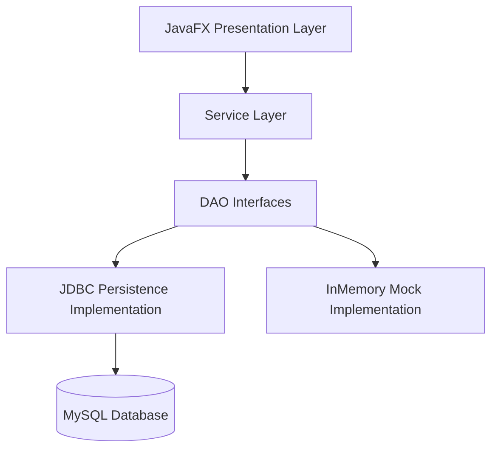

# ArtConnect Pro - Local Art Community Platform

## Overview
ArtConnect Pro is a JavaFX-based management system for local art communities. It allows managing artists, artworks, exhibitions, galleries, workshops, and community members.

Starting from a provided UI and OOP skeleton, the objective of this project was to implement the entire persistence layer and database architecture. It focuses on:
1. **Layered Architecture**: Presentation, Service, DAO, and Model layers.
2. **Database Persistence**: Implementing JDBC DAOs to connect to a MySQL database.
3. **JavaFX UI**: Working with FXML, TableViews, and Controllers.


**My specific contributions:**
* Designed and created the MySQL database schema.
* Implemented the JDBC Data Access Objects (DAOs) to bridge the database with the Java OOP models.

## Project Structure
- `com.project.artconnect.MainApp`: Entry point.
- `com.project.artconnect.model`: Domain entities (POJOs/Stubs).
- `com.project.artconnect.dao`: Data Access Object interfaces.
- `com.project.artconnect.persistence`: JDBC implementations.
- `com.project.artconnect.service`: Business logic layer.
- `com.project.artconnect.ui`: JavaFX Controllers and FXML views.
- `com.project.artconnect.util`: Utility classes like `ConnectionManager` and `ServiceProvider`.

## How to Run
Requirement: Java 17+ and Maven installed.

```bash
mvn clean javafx:run
```
The application can run using **In-Memory Services** (`InMemoryArtistService`, etc.) to demonstrate the UI with dummy data, or using the implemented **JDBC Services** to interact directly with the MySQL database.

## OOP-First Design (Object-Oriented Programming)
Unlike typical database-centric skeletons, ArtConnect Pro follows strict OOP best practices:
- **No Explicit IDs**: Model classes (`Artist`, `Artwork`, etc.) do **not** have `id` fields. In Java, an object's identity is its memory address/reference, not a numeric ID.
- **Direct Object References**: Relationships are modeled using direct references. For example, an `Artwork` object holds a reference to an `Artist` object, not an `artistId`.
- **Bidirectional Links**: Many relationships are bidirectional (e.g., an `Artist` has a `List<Artwork>`, and each `Artwork` points back to its `Artist`).
- **No Junction Tables**: Many-to-Many relationships (like Exhibitions and Artworks) are modeled using simple collections (`List<Artwork>`) rather than separate junction classes.

## 🚀 Technical Challenges Overcome
1. **ID Discovery & Mapping**: Mapped database IDs (Primary Keys) to Java object references, as the initial domain models were strictly OOP and lacked explicit `id` fields.
2. **Relational Mapping**: Reconstructed complex object graphs from relational tables (e.g., linking `Artwork` objects to their respective `Artist` automatically).
3. **Database Setup**: Designed and deployed the MySQL database, handling hidden Foreign Keys and constraints.
4. **JDBC Integration**: Implemented the full `Jdbc` DAO suite in `com.project.artconnect.persistence` and successfully swapped the mock services with real data via the `ServiceProvider`.

## Architecture Diagram


## Testing Instructions
1. Launch the app and verify all 7 tabs load correctly.
2. Search for an artist by name or filter by discipline in the Artists Tab.
3. View the "Discover" tab to see featured content dynamically generated.
4. Swap the `ServiceProvider` to use the `Jdbc` DAOs and verify data is correctly fetched and updated in the MySQL database.
