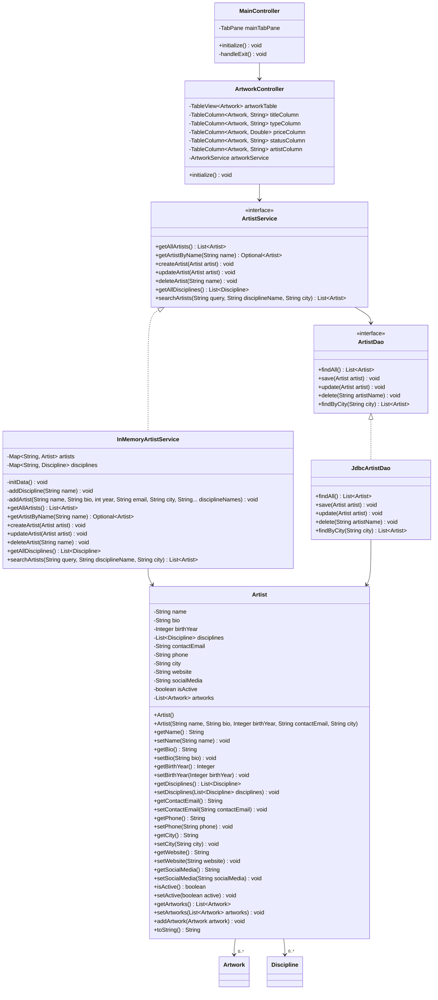

# Analyse de l'Application ArtConnect Pro

## 1. Exploration de l'Application

### Écrans Principaux
L'application utilise une interface JavaFX avec des onglets (tabs) dans la vue principale (`MainView.fxml`). Les écrans principaux sont :
- **ArtistsTab** : Gestion des artistes (liste, recherche, détails).
- **ArtworksTab** : Gestion des œuvres d'art (liste, filtrage, détails).
- **CommunityTab** : Gestion des membres de la communauté.
- **DiscoverTab** : Contenu mis en avant (artistes, œuvres, événements dynamiques).
- **ExhibitionsTab** : Gestion des expositions.
- **GalleriesTab** : Gestion des galeries.
- **WorkshopsTab** : Gestion des ateliers.

L'application se lance avec des données fictives en mémoire, permettant de démontrer l'interface sans base de données.

## 2. Analyse Fonctionnelle

### Fonctionnalités Principales (Point de Vue Utilisateur)
- **Navigation par onglets** : Accès aux différentes sections.
- **Affichage de listes** : TableViews pour artistes, œuvres, etc., avec colonnes pour les attributs principaux.
- **Recherche et filtrage** : Recherche par nom pour artistes, filtrage par discipline, artiste pour œuvres.
- **Détails** : Affichage des informations détaillées pour chaque entité (bio, description, etc.).
- **Découverte** : Onglet Discover avec contenu généré dynamiquement (artistes vedettes, œuvres récentes).
- **Gestion basique** : Boutons pour ajouter/modifier (actuellement simulés avec données en mémoire).

### Rôles/Profils d'Utilisation
- **Visiteur** : Utilisateur anonyme qui parcourt l'application pour découvrir des artistes, œuvres, expositions, galeries et ateliers. Peut rechercher et filtrer le contenu.
- **Artiste** : Membre de la communauté qui gère ses propres œuvres, participe à des expositions et ateliers. Peut mettre à jour ses informations personnelles.
- **Organisateur** : Administrateur ou gestionnaire qui ajoute/modifie des artistes, œuvres, expositions, galeries et ateliers. Gère la communauté et organise des événements.

### Diagramme de Cas d'Utilisation (UML)

**Acteurs :**
- Visiteur
- Artiste
- Organisateur

**Cas d'utilisation pour Visiteur :**
- Parcourir Artistes
- Parcourir Œuvres
- Parcourir Expositions
- Parcourir Galeries
- Parcourir Ateliers
- Découvrir Contenu

**Cas d'utilisation pour Artiste :**
- Gérer Mes Œuvres
- Mettre à Jour Profil
- Participer à Expositions
- Participer à Ateliers

**Cas d'utilisation pour Organisateur :**
- Ajouter/Modifier Artistes
- Ajouter/Modifier Œuvres
- Ajouter/Modifier Expositions
- Ajouter/Modifier Galeries
- Ajouter/Modifier Ateliers
- Gérer Membres Communauté

**Relations :**
- Visiteur → Tous les cas de parcours et découverte
- Artiste → Gestion personnelle et participation
- Organisateur → Toutes les opérations d'ajout/modification et gestion

**Légende :**
- Fonctionnalités déjà présentes : Affichage, recherche, filtrage (cas de parcours).
- Fonctionnalités à implémenter : Persistance en base, authentification (cas d'ajout/modification).

## 3. Conception Statique

### Architecture Globale
L'application suit une architecture en couches :
- **Couche Présentation (UI)** : Contrôleurs JavaFX et vues FXML.
- **Couche Service** : Logique métier, interfaces et implémentations (en mémoire ou JDBC).
- **Couche DAO** : Interfaces pour l'accès aux données.
- **Couche Modèle** : Entités du domaine avec références directes (pas d'IDs explicites en Java).
- **Couche Persistance** : Implémentations JDBC pour MySQL.
- **Utilitaires** : Gestionnaire de connexions, fournisseur de services.

Les relations sont bidirectionnelles, utilisant des références directes plutôt que des clés étrangères explicites.

### Diagramme de Classes 

(Note : Les autres contrôleurs, services et DAOs suivent un pattern similaire.)