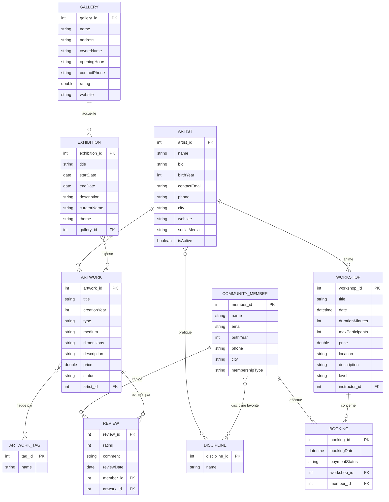

# Étape 2 — Modélisation Conceptuelle et Logique de la Base ArtConnect


## 1. Identification des Entités, Attributs et Relations

### 1.1 Entités et Attributs

À partir de l'analyse des classes du modèle Java et des fonctionnalités identifiées à l'étape 1, nous avons identifié les entités suivantes :

| Entité | Attributs | Identifiant choisi |
|---|---|---|
| **Artist** | name, bio, birthYear, contactEmail, phone, city, website, socialMedia, isActive | `artist_id` (nouvel attribut auto-incrémenté) |
| **Artwork** | title, creationYear, type, medium, dimensions, description, price, status | `artwork_id` (nouvel attribut auto-incrémenté) |
| **Discipline** | name | `discipline_id` (nouvel attribut auto-incrémenté) |
| **ArtworkTag** | name | `tag_id` (nouvel attribut auto-incrémenté) |
| **Gallery** | name, address, ownerName, openingHours, contactPhone, rating, website | `gallery_id` (nouvel attribut auto-incrémenté) |
| **Exhibition** | title, startDate, endDate, description, curatorName, theme | `exhibition_id` (nouvel attribut auto-incrémenté) |
| **Workshop** | title, date, durationMinutes, maxParticipants, price, location, description, level | `workshop_id` (nouvel attribut auto-incrémenté) |
| **CommunityMember** | name, email, birthYear, phone, city, membershipType | `member_id` (nouvel attribut auto-incrémenté) |
| **Booking** | bookingDate, paymentStatus | `booking_id` (nouvel attribut auto-incrémenté) |
| **Review** | rating, comment, reviewDate | `review_id` (nouvel attribut auto-incrémenté) |

**Justification du choix des identifiants :** Les classes Java du modèle n'ont pas d'attributs `id` (approche OOP pure où l'identité est la référence mémoire). Au niveau base de données, nous ajoutons un identifiant numérique auto-incrémenté (`INT AUTO_INCREMENT`) pour chaque entité, car :
- Aucun attribut métier ne garantit l'unicité absolue (deux artistes pourraient avoir le même nom).
- Les clés de substitution sont plus performantes pour les jointures.
- Elles simplifient la gestion des clés étrangères.

### 1.2 Relations identifiées

| Relation | Type | Description |
|---|---|---|
| Artist — Discipline | 1,N:0,N | Un artiste peut maîtriser plusieurs disciplines ; une discipline peut être pratiquée par plusieurs artistes. |
| Artist — Artwork | 1,N:1,1 | Un artiste crée plusieurs œuvres ; une œuvre est créée par un seul artiste. |
| Gallery — Exhibition | 1,N:1,1 | Une galerie accueille plusieurs expositions ; une exposition se tient dans une seule galerie. |
| Exhibition — Artwork | 1,N:0,N | Une exposition présente plusieurs œuvres ; une œuvre peut apparaître dans plusieurs expositions. |
| Artist — Workshop | 0,N:1,1 | Un artiste (instructeur) anime plusieurs ateliers ; un atelier a un seul instructeur. |
| Workshop — CommunityMember (via Booking) | 0,N:1,N | Un membre peut réserver plusieurs ateliers ; un atelier peut être réservé par plusieurs membres. La réservation (Booking) est l'entité associative. |
| CommunityMember — Artwork (via Review) | 0,N:0,N | Un membre peut évaluer plusieurs œuvres ; une œuvre peut être évaluée par plusieurs membres. L'avis (Review) est l'entité associative. |
| CommunityMember — Discipline | 0,N:0,N | Un membre a des disciplines favorites ; une discipline peut être favorite de plusieurs membres. |
| Artwork — ArtworkTag | 1,N:1,N | Une œuvre peut avoir plusieurs tags ; un tag peut être associé à plusieurs œuvres. |

### 1.3 Dépendances Fonctionnelles

**Artist :**
- artist_id → name, bio, birthYear, contactEmail, phone, city, website, socialMedia, isActive

**Artwork :**
- artwork_id → title, creationYear, type, medium, dimensions, description, price, status, artist_id

**Discipline :**
- discipline_id → name

**ArtworkTag :**
- tag_id → name

**Gallery :**
- gallery_id → name, address, ownerName, openingHours, contactPhone, rating, website

**Exhibition :**
- exhibition_id → title, startDate, endDate, description, curatorName, theme, gallery_id

**Workshop :**
- workshop_id → title, date, durationMinutes, maxParticipants, price, location, description, level, instructor_id

**CommunityMember :**
- member_id → name, email, birthYear, phone, city, membershipType

**Booking :**
- booking_id → bookingDate, paymentStatus, workshop_id, member_id

**Review :**
- review_id → rating, comment, reviewDate, member_id, artwork_id


## 2. Modèle Conceptuel de Données (MCD / ERD)



|| correspond aux cardinalités 0,1 ou 1,1
o{ correspond aux cardinalités 0,N ou 1,N


## 3. Modèle Logique de Données (MLD)

La transformation du MCD en MLD donne les tables suivantes. Les relations N:M sont transformées en tables de jonction.

### 3.1 Tables principales

**artist** (artist_id `PK`, name, bio, birth_year, contact_email, phone, city, website, social_media, is_active)

**discipline** (discipline_id `PK`, name `UNIQUE`)

**artwork** (artwork_id `PK`, title, creation_year, type, medium, dimensions, description, price, status, artist_id `FK → artist`)

**artwork_tag** (tag_id `PK`, name `UNIQUE`)

**gallery** (gallery_id `PK`, name, address, owner_name, opening_hours, contact_phone, rating, website)

**exhibition** (exhibition_id `PK`, title, start_date, end_date, description, curator_name, theme, gallery_id `FK → gallery`)

**workshop** (workshop_id `PK`, title, date, duration_minutes, max_participants, price, location, description, level, instructor_id `FK → artist`)

**community_member** (member_id `PK`, name, email `UNIQUE`, birth_year, phone, city, membership_type)

**booking** (booking_id `PK`, booking_date, payment_status, workshop_id `FK → workshop`, member_id `FK → community_member`)

**review** (review_id `PK`, rating, comment, review_date, member_id `FK → community_member`, artwork_id `FK → artwork`)

### 3.2 Tables de jonction (relations N:M)

**artist_discipline** (artist_id `FK/PK → artist`, discipline_id `FK/PK → discipline`)
- Clé primaire composée : (artist_id, discipline_id)

**member_favorite_discipline** (member_id `FK/PK → community_member`, discipline_id `FK/PK → discipline`)
- Clé primaire composée : (member_id, discipline_id)

**exhibition_artwork** (exhibition_id `FK/PK → exhibition`, artwork_id `FK/PK → artwork`)
- Clé primaire composée : (exhibition_id, artwork_id)

**artwork_tag_association** (artwork_id `FK/PK → artwork`, tag_id `FK/PK → artwork_tag`)
- Clé primaire composée : (artwork_id, tag_id)

### 3.3 Schéma relationnel résumé

```
artist (artist_id, name, bio, birth_year, contact_email, phone, city, website, social_media, is_active)
discipline (discipline_id, name)
artist_discipline (artist_id, discipline_id)
artwork (artwork_id, title, creation_year, type, medium, dimensions, description, price, status, #artist_id)
artwork_tag (tag_id, name)
artwork_tag_association (artwork_id, tag_id)
gallery (gallery_id, name, address, owner_name, opening_hours, contact_phone, rating, website)
exhibition (exhibition_id, title, start_date, end_date, description, curator_name, theme, #gallery_id)
exhibition_artwork (exhibition_id, artwork_id)
workshop (workshop_id, title, date, duration_minutes, max_participants, price, location, description, level, #instructor_id)
community_member (member_id, name, email, birth_year, phone, city, membership_type)
member_favorite_discipline (member_id, discipline_id)
booking (booking_id, booking_date, payment_status, #workshop_id, #member_id)
review (review_id, rating, comment, review_date, #member_id, #artwork_id)
```

(Les attributs précédés de `#` sont des clés étrangères.)


## 4. Normalisation (jusqu'à la 3FN)

### 4.1 Première Forme Normale (1FN)

> Une table est en 1FN si tous ses attributs sont atomiques (pas de valeurs multiples ou de groupes répétitifs).

**Vérification :**
- Dans le modèle Java, `Artist` possède une `List<Discipline>` (multi-valué) → résolu par la table de jonction `artist_discipline`.
- `Artist` possède une `List<Artwork>` → résolu par la clé étrangère `artist_id` dans `artwork`.
- `CommunityMember` possède `List<Discipline>` (favorites) → résolu par `member_favorite_discipline`.
- `CommunityMember` possède `List<Booking>` et `List<Review>` → résolu par les FK dans `booking` et `review`.
- `Exhibition` possède `List<Artwork>` → résolu par `exhibition_artwork`.
- `Artwork` possède `List<ArtworkTag>` → résolu par `artwork_tag_association`.
- `Gallery` possède `List<Exhibition>` → résolu par la FK `gallery_id` dans `exhibition`.

**Résultat :** Toutes les tables respectent la 1FN — chaque attribut contient une valeur atomique unique.

### 4.2 Deuxième Forme Normale (2FN)

> Une table est en 2FN si elle est en 1FN et que chaque attribut non-clé dépend entièrement de la totalité de la clé primaire (pas de dépendance partielle).

**Vérification des tables à clé composée :**
- `artist_discipline (artist_id, discipline_id)` : pas d'attribut non-clé → 2FN triviale.
- `member_favorite_discipline (member_id, discipline_id)` : pas d'attribut non-clé → 2FN triviale.
- `exhibition_artwork (exhibition_id, artwork_id)` : pas d'attribut non-clé → 2FN triviale.
- `artwork_tag_association (artwork_id, tag_id)` : pas d'attribut non-clé → 2FN triviale.

**Tables à clé simple (PK auto-incrémenté) :** La 2FN est automatiquement respectée puisque la clé primaire est un seul attribut — aucune dépendance partielle n'est possible.

**Résultat :** Toutes les tables sont en 2FN.

### 4.3 Troisième Forme Normale (3FN)

> Une table est en 3FN si elle est en 2FN et qu'aucun attribut non-clé ne dépend transitivement d'un autre attribut non-clé.

**Vérification des tables principales :**

- **artist** : Tous les attributs (name, bio, birth_year, contact_email, phone, city, website, social_media, is_active) dépendent directement et uniquement de `artist_id`. Pas de dépendance transitive (city ne détermine pas d'autre attribut, etc.).

- **artwork** : Tous les attributs dépendent de `artwork_id`. On pourrait se demander si `type` → `medium` (ex: "Painting" → "Oil"), mais dans notre domaine un même type peut avoir différents media (painting → oil, watercolor, acrylic...). Pas de transitivité.

- **gallery** : Tous les attributs dépendent de `gallery_id`. `address` ne détermine pas `owner_name` (un propriétaire peut changer sans que l'adresse change).

- **exhibition** : `curator_name` est un attribut simple ici (pas une entité séparée car aucune autre information n'est stockée sur le curateur). Si on souhaitait stocker plus d'informations sur les curateurs, il faudrait créer une entité `Curator` séparée.

- **workshop** : Tous les attributs dépendent de `workshop_id`. `instructor_id` est une FK vers `artist` — c'est une référence externe, pas une transitivité.

- **community_member** : Tous les attributs dépendent de `member_id`. `membership_type` est un attribut simple (free/premium) sans attributs dépendants.

- **booking** : `booking_date` et `payment_status` dépendent directement de `booking_id`. Les FK `workshop_id` et `member_id` sont des références.

- **review** : `rating`, `comment`, `review_date` dépendent directement de `review_id`. Les FK sont des références.

**Résultat :** Toutes les tables sont en 3FN. Aucune dépendance transitive n'a été identifiée.


## 5. Script SQL de Création de la Base de Données

```sql

DROP DATABASE IF EXISTS artconnect_db;
CREATE DATABASE artconnect_db
    CHARACTER SET utf8mb4
    COLLATE utf8mb4_unicode_ci;

USE artconnect_db;

-- 1. Tables sans dépendances (entités indépendantes)

CREATE TABLE discipline (
    discipline_id   INT             AUTO_INCREMENT PRIMARY KEY,
    name            VARCHAR(100)    NOT NULL UNIQUE
) ENGINE=InnoDB;

CREATE TABLE artwork_tag (
    tag_id          INT             AUTO_INCREMENT PRIMARY KEY,
    name            VARCHAR(100)    NOT NULL UNIQUE
) ENGINE=InnoDB;

CREATE TABLE artist (
    artist_id       INT             AUTO_INCREMENT PRIMARY KEY,
    name            VARCHAR(200)    NOT NULL,
    bio             TEXT,
    birth_year      INT,
    contact_email   VARCHAR(200),
    phone           VARCHAR(50),
    city            VARCHAR(100),
    website         VARCHAR(255),
    social_media    VARCHAR(255),
    is_active       BOOLEAN         NOT NULL DEFAULT TRUE,

    CONSTRAINT chk_artist_birth_year CHECK (birth_year IS NULL OR birth_year > 0)
) ENGINE=InnoDB;

CREATE TABLE gallery (
    gallery_id      INT             AUTO_INCREMENT PRIMARY KEY,
    name            VARCHAR(200)    NOT NULL,
    address         VARCHAR(300),
    owner_name      VARCHAR(200),
    opening_hours   VARCHAR(200),
    contact_phone   VARCHAR(50),
    rating          DECIMAL(2,1)    DEFAULT 0.0,
    website         VARCHAR(255),

    CONSTRAINT chk_gallery_rating CHECK (rating >= 0.0 AND rating <= 5.0)
) ENGINE=InnoDB;

CREATE TABLE community_member (
    member_id       INT             AUTO_INCREMENT PRIMARY KEY,
    name            VARCHAR(200)    NOT NULL,
    email           VARCHAR(200)    NOT NULL UNIQUE,
    birth_year      INT,
    phone           VARCHAR(50),
    city            VARCHAR(100),
    membership_type VARCHAR(50)     NOT NULL DEFAULT 'free',

    CONSTRAINT chk_member_membership CHECK (membership_type IN ('free', 'premium'))
) ENGINE=InnoDB;


-- 2. Tables avec dépendances simples (FK vers tables ci-dessus)

CREATE TABLE artwork (
    artwork_id      INT             AUTO_INCREMENT PRIMARY KEY,
    title           VARCHAR(300)    NOT NULL,
    creation_year   INT,
    type            VARCHAR(100),
    medium          VARCHAR(100),
    dimensions      VARCHAR(100),
    description     TEXT,
    price           DECIMAL(15,2)   NOT NULL DEFAULT 0.00,
    status          ENUM('FOR_SALE','SOLD','EXHIBITED') NOT NULL DEFAULT 'FOR_SALE',
    artist_id       INT             NOT NULL,

    CONSTRAINT fk_artwork_artist
        FOREIGN KEY (artist_id) REFERENCES artist(artist_id)
        ON DELETE CASCADE ON UPDATE CASCADE,

    CONSTRAINT chk_artwork_price CHECK (price >= 0)
) ENGINE=InnoDB;

CREATE TABLE exhibition (
    exhibition_id   INT             AUTO_INCREMENT PRIMARY KEY,
    title           VARCHAR(300)    NOT NULL,
    start_date      DATE            NOT NULL,
    end_date        DATE            NOT NULL,
    description     TEXT,
    curator_name    VARCHAR(200),
    theme           VARCHAR(200),
    gallery_id      INT             NOT NULL,

    CONSTRAINT fk_exhibition_gallery
        FOREIGN KEY (gallery_id) REFERENCES gallery(gallery_id)
        ON DELETE CASCADE ON UPDATE CASCADE,

    CONSTRAINT chk_exhibition_dates CHECK (end_date >= start_date)
) ENGINE=InnoDB;

CREATE TABLE workshop (
    workshop_id     INT             AUTO_INCREMENT PRIMARY KEY,
    title           VARCHAR(300)    NOT NULL,
    date            DATETIME        NOT NULL,
    duration_minutes INT            DEFAULT 60,
    max_participants INT            DEFAULT 10,
    price           DECIMAL(10,2)   NOT NULL DEFAULT 0.00,
    location        VARCHAR(300),
    description     TEXT,
    level           ENUM('Beginner','Intermediate','Advanced') NOT NULL DEFAULT 'Beginner',
    instructor_id   INT             NOT NULL,

    CONSTRAINT fk_workshop_instructor
        FOREIGN KEY (instructor_id) REFERENCES artist(artist_id)
        ON DELETE CASCADE ON UPDATE CASCADE,

    CONSTRAINT chk_workshop_price CHECK (price >= 0),
    CONSTRAINT chk_workshop_duration CHECK (duration_minutes > 0),
    CONSTRAINT chk_workshop_participants CHECK (max_participants > 0)
) ENGINE=InnoDB;


-- 3. Entités associatives (Booking, Review)

CREATE TABLE booking (
    booking_id      INT             AUTO_INCREMENT PRIMARY KEY,
    booking_date    DATETIME        NOT NULL DEFAULT CURRENT_TIMESTAMP,
    payment_status  ENUM('PENDING','PAID','CANCELLED') NOT NULL DEFAULT 'PENDING',
    workshop_id     INT             NOT NULL,
    member_id       INT             NOT NULL,

    CONSTRAINT fk_booking_workshop
        FOREIGN KEY (workshop_id) REFERENCES workshop(workshop_id)
        ON DELETE CASCADE ON UPDATE CASCADE,
    CONSTRAINT fk_booking_member
        FOREIGN KEY (member_id) REFERENCES community_member(member_id)
        ON DELETE CASCADE ON UPDATE CASCADE,

    -- Un membre ne peut réserver qu'une seule fois le même atelier
    CONSTRAINT uq_booking_member_workshop UNIQUE (workshop_id, member_id)
) ENGINE=InnoDB;

CREATE TABLE review (
    review_id       INT             AUTO_INCREMENT PRIMARY KEY,
    rating          INT             NOT NULL,
    comment         TEXT,
    review_date     DATE            NOT NULL DEFAULT (CURRENT_DATE),
    member_id       INT             NOT NULL,
    artwork_id      INT             NOT NULL,

    CONSTRAINT fk_review_member
        FOREIGN KEY (member_id) REFERENCES community_member(member_id)
        ON DELETE CASCADE ON UPDATE CASCADE,
    CONSTRAINT fk_review_artwork
        FOREIGN KEY (artwork_id) REFERENCES artwork(artwork_id)
        ON DELETE CASCADE ON UPDATE CASCADE,

    CONSTRAINT chk_review_rating CHECK (rating >= 1 AND rating <= 5),

    -- Un membre ne peut évaluer qu'une seule fois la même œuvre
    CONSTRAINT uq_review_member_artwork UNIQUE (member_id, artwork_id)
) ENGINE=InnoDB;


-- 4. Tables de jonction (relations N:M)

CREATE TABLE artist_discipline (
    artist_id       INT NOT NULL,
    discipline_id   INT NOT NULL,

    PRIMARY KEY (artist_id, discipline_id),

    CONSTRAINT fk_ad_artist
        FOREIGN KEY (artist_id) REFERENCES artist(artist_id)
        ON DELETE CASCADE ON UPDATE CASCADE,
    CONSTRAINT fk_ad_discipline
        FOREIGN KEY (discipline_id) REFERENCES discipline(discipline_id)
        ON DELETE CASCADE ON UPDATE CASCADE
) ENGINE=InnoDB;

CREATE TABLE member_favorite_discipline (
    member_id       INT NOT NULL,
    discipline_id   INT NOT NULL,

    PRIMARY KEY (member_id, discipline_id),

    CONSTRAINT fk_mfd_member
        FOREIGN KEY (member_id) REFERENCES community_member(member_id)
        ON DELETE CASCADE ON UPDATE CASCADE,
    CONSTRAINT fk_mfd_discipline
        FOREIGN KEY (discipline_id) REFERENCES discipline(discipline_id)
        ON DELETE CASCADE ON UPDATE CASCADE
) ENGINE=InnoDB;

CREATE TABLE exhibition_artwork (
    exhibition_id   INT NOT NULL,
    artwork_id      INT NOT NULL,

    PRIMARY KEY (exhibition_id, artwork_id),

    CONSTRAINT fk_ea_exhibition
        FOREIGN KEY (exhibition_id) REFERENCES exhibition(exhibition_id)
        ON DELETE CASCADE ON UPDATE CASCADE,
    CONSTRAINT fk_ea_artwork
        FOREIGN KEY (artwork_id) REFERENCES artwork(artwork_id)
        ON DELETE CASCADE ON UPDATE CASCADE
) ENGINE=InnoDB;

CREATE TABLE artwork_tag_association (
    artwork_id      INT NOT NULL,
    tag_id          INT NOT NULL,

    PRIMARY KEY (artwork_id, tag_id),

    CONSTRAINT fk_ata_artwork
        FOREIGN KEY (artwork_id) REFERENCES artwork(artwork_id)
        ON DELETE CASCADE ON UPDATE CASCADE,
    CONSTRAINT fk_ata_tag
        FOREIGN KEY (tag_id) REFERENCES artwork_tag(tag_id)
        ON DELETE CASCADE ON UPDATE CASCADE
) ENGINE=InnoDB;
```


## 6. Récapitulatif des Tables

| # | Table | Clé Primaire | Clés Étrangères | Rôle |
|---|---|---|---|---|
| 1 | `discipline` | discipline_id | — | Référentiel des disciplines artistiques |
| 2 | `artwork_tag` | tag_id | — | Référentiel des tags pour œuvres |
| 3 | `artist` | artist_id | — | Artistes de la communauté |
| 4 | `gallery` | gallery_id | — | Galeries d'art |
| 5 | `community_member` | member_id | — | Membres de la communauté |
| 6 | `artwork` | artwork_id | artist_id → artist | Œuvres d'art |
| 7 | `exhibition` | exhibition_id | gallery_id → gallery | Expositions |
| 8 | `workshop` | workshop_id | instructor_id → artist | Ateliers |
| 9 | `booking` | booking_id | workshop_id → workshop, member_id → community_member | Réservations d'ateliers |
| 10 | `review` | review_id | member_id → community_member, artwork_id → artwork | Avis sur les œuvres |
| 11 | `artist_discipline` | (artist_id, discipline_id) | FK × 2 | Jonction artiste ↔ discipline |
| 12 | `member_favorite_discipline` | (member_id, discipline_id) | FK × 2 | Jonction membre ↔ discipline favorite |
| 13 | `exhibition_artwork` | (exhibition_id, artwork_id) | FK × 2 | Jonction exposition ↔ œuvre |
| 14 | `artwork_tag_association` | (artwork_id, tag_id) | FK × 2 | Jonction œuvre ↔ tag |

**Total : 10 tables principales + 4 tables de jonction = 14 tables.**
