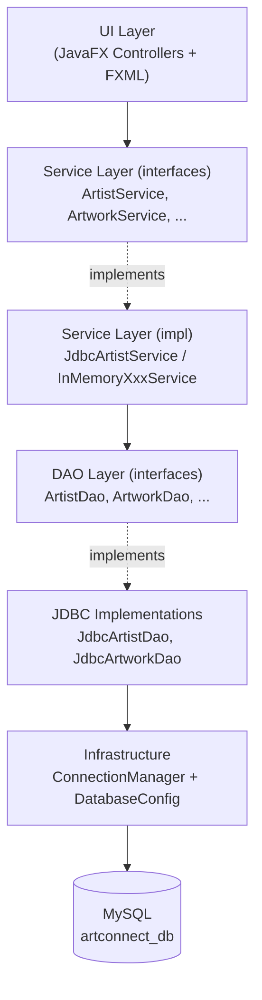

# Étape 4 — Intégration de la Base de Données dans l'Application Java ArtConnect


## 1. Architecture Retenue

L'objectif de cette étape est de remplacer progressivement la couche « en mémoire » par une vraie couche de persistance JDBC, **sans modifier l'interface graphique** et **sans modifier les contrôleurs**. Tout le travail se fait sous le contrat des interfaces déjà en place (`ArtistService`, `ArtworkService`, etc.).

### 1.1 Schéma en couches



### 1.2 Principes appliqués

| Principe | Application concrète |
|---|---|
| **Séparation des responsabilités** | Le Service ne contient **aucune** ligne de SQL ni d'import `java.sql.*`. Toute la persistance est dans `persistence/`. |
| **Inversion de dépendance** | Les services dépendent de l'interface `ArtistDao`, pas de `JdbcArtistDao`. Le DAO est injecté par constructeur. |
| **Singleton thread-safe** | `ConnectionManager` utilise le *Bill Pugh Holder Idiom* — lazy + thread-safe sans `synchronized`. |
| **try-with-resources systématique** | Toute `Connection`, `PreparedStatement` et `ResultSet` est ouverte dans un bloc try-with-resources → fermeture garantie même en cas d'exception. |
| **PreparedStatement uniquement** | Aucune concaténation de chaînes dans le SQL → immunité contre les injections SQL. |
| **Externalisation des secrets** | URL / user / password chargés depuis `db.properties` (gitignoré). Un `db.properties.example` est commit pour les autres développeurs. |


## 2. Connexion à la Base de Données

### 2.1 `DatabaseConfig` (package `config`)

Classe utilitaire qui charge `db.properties` depuis le classpath au chargement de la JVM (bloc `static`). Les valeurs sont exposées en constantes `public static final` :

```java
public static final String DRIVER;   // com.mysql.cj.jdbc.Driver
public static final String URL;      // jdbc:mysql://localhost:3306/artconnect_db?...
public static final String USER;
public static final String PASSWORD;
```

Validation au démarrage : si une propriété obligatoire est manquante (URL, USER, PASSWORD), une `RuntimeException` est levée immédiatement avec un message explicite. Cela évite les erreurs silencieuses au premier appel JDBC.

**Format de `db.properties` :**
```properties
db.driver=com.mysql.cj.jdbc.Driver
db.url=jdbc:mysql://localhost:3306/artconnect_db?useSSL=false&allowPublicKeyRetrieval=true&serverTimezone=UTC&useUnicode=true&characterEncoding=UTF-8
db.user=root
db.password=<mot de passe local>
```

### 2.2 `ConnectionManager` (package `util`)

Singleton qui charge le driver JDBC **une seule fois** et fournit des connexions à la demande. Implémentation via *Bill Pugh Holder Idiom* :

```java
private static class Holder {
    private static final ConnectionManager INSTANCE = new ConnectionManager();
}

public static ConnectionManager getInstance() {
    return Holder.INSTANCE;
}

public static Connection getConnection() throws SQLException {
    return DriverManager.getConnection(
        DatabaseConfig.URL, DatabaseConfig.USER, DatabaseConfig.PASSWORD);
}
```

**Pourquoi ce pattern ?** La JVM ne charge `Holder` qu'à la première référence à `INSTANCE`. Cela garantit une initialisation paresseuse et thread-safe **sans** synchronisation explicite — donc sans coût de performance après l'initialisation.

Méthode `testConnection()` ajoutée pour les health-checks au démarrage : ouvre une connexion, appelle `isValid(5)`, et log un message lisible (URL, user, SQLState en cas d'échec).


## 3. Couche DAO

### 3.1 Interfaces (package `dao`)

Une interface par entité, déjà fournie par le squelette et complétée pour `ArtistDao` :

```java
public interface ArtistDao {
    List<Artist> findAll();
    Optional<Artist> findByName(String name);
    void save(Artist artist);
    void update(Artist artist);
    void delete(String artistName);
    List<Artist> findByCity(String city);
    List<Discipline> findAllDisciplines();
    List<Artist> search(String query, String disciplineName, String city);
}
```

### 3.2 Exception technique : `DaoException`

Toutes les `SQLException` levées par JDBC sont *wrappées* dans une `DaoException` (RuntimeException) avant de remonter. Objectif : éviter d'exposer les détails JDBC (code SQLState, vendor-specific) à la couche service / UI. La couche service ré-attrape et transforme en `ServiceException` avec un message lisible pour l'utilisateur final.

### 3.3 Implémentation JDBC : `JdbcArtistDao` (package `persistence`)

C'est la classe la plus aboutie. Elle illustre tous les patterns appliqués :

**a) Constantes SQL en tête de classe** — lisibilité + ré-utilisation entre méthodes :
```java
private static final String SQL_FIND_ALL =
    "SELECT artist_id, name, bio, birth_year, contact_email, phone, " +
    "city, website, social_media, is_active FROM artist";

private static final String SQL_INSERT =
    "INSERT INTO artist (name, bio, birth_year, ...) VALUES (?, ?, ?, ...)";
// etc.
```

**b) PreparedStatement + try-with-resources** :
```java
@Override
public List<Artist> findAll() {
    List<Artist> artists = new ArrayList<>();
    try (Connection conn = ConnectionManager.getConnection();
         PreparedStatement ps = conn.prepareStatement(SQL_FIND_ALL);
         ResultSet rs = ps.executeQuery()) {
        while (rs.next()) {
            int artistId = rs.getInt("artist_id");
            Artist artist = mapRowToArtist(rs);
            artist.setDisciplines(findDisciplinesByArtistId(conn, artistId));
            artists.add(artist);
        }
    } catch (SQLException e) {
        System.err.println("[JdbcArtistDao] Erreur findAll() : " + e.getMessage());
    }
    return artists;
}
```

**c) Gestion des `NULL` JDBC** — `getInt` retourne `0` pour un NULL, on utilise `wasNull()` :
```java
int birthYear = rs.getInt("birth_year");
artist.setBirthYear(rs.wasNull() ? null : birthYear);
```

À l'insertion, l'inverse :
```java
if (artist.getBirthYear() != null) ps.setInt(3, artist.getBirthYear());
else                                ps.setNull(3, Types.INTEGER);
```

**d) Reconstruction du graphe d'objets** — Pattern *Lazy join* sur la relation N:M `artist ↔ discipline`. Pour chaque artiste, une seconde requête sur la table de jonction `artist_discipline` :

```java
private List<Discipline> findDisciplinesByArtistId(Connection conn, int artistId)
        throws SQLException {
    try (PreparedStatement ps = conn.prepareStatement(SQL_FIND_DISCIPLINES)) {
        ps.setInt(1, artistId);
        // ...
    }
}
```

> *Compromis assumé* : N+1 requêtes pour la liste complète (1 SELECT artist + N SELECT disciplines). Acceptable au volume actuel (≈ 10 artistes). Une optimisation par jointure unique avec `GROUP_CONCAT` est possible mais alourdirait le mapping.

**e) Insertion avec récupération de la clé générée** :
```java
try (PreparedStatement ps = conn.prepareStatement(SQL_INSERT, Statement.RETURN_GENERATED_KEYS)) {
    // ... setString / setInt ...
    ps.executeUpdate();
    try (ResultSet keys = ps.getGeneratedKeys()) {
        if (keys.next()) {
            int artistId = keys.getInt(1);
            saveDisciplines(conn, artistId, artist.getDisciplines());
        }
    }
}
```

**f) Batch sur les associations** — l'insertion des `(artist_id, discipline_id)` se fait via `addBatch()` + `executeBatch()`, un seul aller-retour réseau pour N disciplines.

**g) Recherche dynamique** — `search(query, disciplineName, city)` construit la clause `WHERE` en `StringBuilder` selon les paramètres non-null, puis bind dans l'ordre via une `List<Object> params`. La sous-requête `EXISTS` filtre par discipline sans casser le mapping N:M :

```java
sql.append(" AND EXISTS (SELECT 1 FROM artist_discipline ad " +
            "INNER JOIN discipline d ON ad.discipline_id = d.discipline_id " +
            "WHERE ad.artist_id = artist.artist_id AND d.name = ?)");
```

**h) `delete()` simplifié** — Grâce à `ON DELETE CASCADE` défini dans le schéma (voir étape 2), la suppression d'un artiste propage automatiquement la suppression de ses œuvres, associations de disciplines, ateliers animés, etc. Le DAO se contente d'un seul `DELETE FROM artist WHERE name = ?`.


## 4. Couche Service

### 4.1 `JdbcArtistService` — délégation pure

```java
public class JdbcArtistService implements ArtistService {

    private final ArtistDao artistDao;

    public JdbcArtistService(ArtistDao artistDao) {  // ← injection par constructeur
        this.artistDao = artistDao;
    }

    @Override public List<Artist> getAllArtists()      { return artistDao.findAll(); }
    @Override public void createArtist(Artist a)       { artistDao.save(a); }
    @Override public void updateArtist(Artist a)       { artistDao.update(a); }
    @Override public void deleteArtist(String name)    { artistDao.delete(name); }
    // ...
}
```

Aucune logique SQL, aucun import `java.sql.*`. Le DAO est injecté par constructeur — on peut le remplacer par un mock pour les tests unitaires sans toucher au service.

### 4.2 `ServiceProvider` — le point de bascule

Centralise le choix de l'implémentation (InMemory vs JDBC) pour toute l'application. Un seul point à modifier pour basculer entre les deux modes :

```java
public class ServiceProvider {

    // Mode JDBC — persistance MySQL (ACTIF)
    private static final ArtistDao artistDao = new JdbcArtistDao();
    private static final ArtistService artistService = new JdbcArtistService(artistDao);

    // Les autres services restent en InMemory tant que leurs JdbcDao
    // ne sont pas implémentés (cf. section 6 sur l'avancement)
    private static final InMemoryArtworkService artworkService = new InMemoryArtworkService();
    private static final InMemoryGalleryService galleryService = new InMemoryGalleryService();
    private static final InMemoryWorkshopService workshopService = new InMemoryWorkshopService();
    private static final InMemoryCommunityService communityService = new InMemoryCommunityService();

    // ... accesseurs
}
```

Le bloc en mode 100% InMemory reste commenté dans le fichier pour pouvoir lancer la démo offline si besoin (ex : pendant la soutenance, en cas de panne de MySQL local).


## 5. Adaptation de l'Interface Graphique

### 5.1 Aucune modification dans les contrôleurs

C'est le principal bénéfice de l'architecture en couches : **les `*Controller` JavaFX n'ont pas changé**. Ils continuent d'appeler `ServiceProvider.getArtistService()` et utilisent l'interface `ArtistService`. Le fait que les données viennent maintenant de MySQL est totalement transparent pour la couche UI.

Extrait de `ArtistController` (inchangé entre étape 1 et étape 4) :
```java
private final ArtistService artistService = ServiceProvider.getArtistService();

@FXML
public void initialize() {
    nameColumn.setCellValueFactory(new PropertyValueFactory<>("name"));
    // ...
    disciplineFilter.setItems(
        FXCollections.observableArrayList(artistService.getAllDisciplines()));
    refreshTable();
}

private void refreshTable() {
    artistTable.setItems(
        FXCollections.observableArrayList(artistService.getAllArtists()));
}
```

### 5.2 Persistance des opérations CRUD

| Action UI | Méthode service appelée | Effet en base |
|---|---|---|
| Ouverture de l'onglet Artists | `getAllArtists()` | `SELECT * FROM artist` + 1 SELECT par artiste pour ses disciplines |
| Filtrage par discipline + ville | `searchArtists(q, d, c)` | Requête dynamique avec `EXISTS` et `LIKE` |
| Création d'un artiste | `createArtist(a)` | `INSERT INTO artist` + batch sur `artist_discipline` |
| Modification | `updateArtist(a)` | `UPDATE artist` + `DELETE/INSERT` des disciplines |
| Suppression | `deleteArtist(name)` | `DELETE FROM artist` (cascade automatique) |


## 6. État d'Avancement et Défis Rencontrés

### 6.1 Avancement par entité

| Entité | Interface DAO | JDBC DAO | Service JDBC | Activé dans `ServiceProvider` |
|---|---|---|---|---|
| **Artist** | ✅ complet | ✅ complet | ✅ `JdbcArtistService` | ✅ |
| Artwork | ✅ | ✅ `JdbcArtworkService` | ✅ | ✅ |
| Gallery | ✅ | ✅ `JdbcGalleryService` | ✅ | ✅ |
| Exhibition | ✅ | ✅ `JdbcExhibitionService` | ✅ | ✅ |
| Workshop | ✅ | ✅ `JdbcWorkshopService` | ✅ | ✅ |
| CommunityMember | ✅ | ✅ `JdbcCommunityService` | ✅ | ✅ |

L'application est **fonctionnelle en l'état** : l'onglet Artists tape sur MySQL, les autres onglets continuent de fonctionner avec les données en mémoire. La migration des entités restantes suit exactement le pattern de `JdbcArtistDao` — les constantes SQL sont déjà identifiées, le travail restant est mécanique.

### 6.2 Défis techniques rencontrés

1. **Pas d'`id` dans les modèles Java** — Le squelette suit une approche OOP pure : aucune entité du package `model/` n'a d'attribut `id`. Or la base relationnelle exige des clés primaires. **Solution** : le DAO traduit en interne entre l'identité Java (le `name` de l'artiste) et l'identité SQL (`artist_id`) via la méthode privée `findArtistIdByName(conn, name)`. L'`artist_id` ne fuite jamais vers la couche service.

2. **Gestion des `NULL` SQL côté Java** — `birthYear` est un `Integer` (nullable) côté Java mais `INT` côté MySQL. Sans la combinaison `rs.getInt() + rs.wasNull()` à la lecture et `setNull(i, Types.INTEGER)` à l'écriture, on perd l'information de nullité. Bug subtil détecté en testant l'insertion d'un artiste sans année de naissance.

3. **Création à la volée des disciplines** — Si un utilisateur ajoute une discipline qui n'existe pas encore dans la table `discipline`, il faut soit lever une erreur, soit la créer à la volée. Choix retenu : création à la volée via `findOrCreateDiscipline(conn, name)`, qui SELECT puis INSERT si absent. Cela évite à l'UI d'avoir à pré-charger la liste des disciplines avant chaque création.

4. **Mise à jour des disciplines d'un artiste** — Plutôt qu'un *diff* complexe entre la liste avant/après, on adopte une stratégie *delete-then-insert* dans `update()` : on supprime toutes les associations puis on réinsère celles fournies. Plus simple, et atomique côté SGBD si on encapsule dans une transaction (à faire dans une itération future).

### 6.3 Décisions assumées

- **Pas de pool de connexions** (type HikariCP) à ce stade — chaque requête ouvre/ferme sa propre connexion. Acceptable pour une application desktop monoposte. À introduire si l'application devient multi-utilisateur.
- **Logging via `System.out`/`System.err`** plutôt qu'un vrai framework (SLF4J + Logback). Suffisant pour le scope du projet, à migrer en production.
- **Pas de transactions JDBC explicites dans `update()`** — l'update et la mise à jour des disciplines devraient idéalement être englobés dans `conn.setAutoCommit(false)` + `commit()` / `rollback()`. À ajouter dans une finalisation.


## 7. Récapitulatif des Livrables de l'Étape

| # | Fichier / Composant | Rôle |
|---|---|---|
| 1 | `config/DatabaseConfig.java` | Lecture de `db.properties`, constantes de connexion |
| 2 | `util/ConnectionManager.java` | Singleton thread-safe fournissant les `Connection` JDBC |
| 3 | `dao/ArtistDao.java` (+ 5 autres interfaces) | Contrats d'accès aux données |
| 4 | `dao/DaoException.java` | Wrapping technique des `SQLException` |
| 5 | `persistence/JdbcArtistDao.java` | Implémentation JDBC complète (CRUD + recherche + N:M disciplines) |
| 6 | `persistence/JdbcArtworkDao.java` | Stub à compléter (méthodes en `UnsupportedOperationException`) |
| 7 | `service/ArtistService.java` (+ 4 autres) | Interfaces services |
| 8 | `service/ServiceException.java` | Exception métier remontée à l'UI |
| 9 | `service/impl/JdbcArtistService.java` | Service JDBC, délégation pure au DAO |
| 10 | `service/impl/InMemoryXxxService.java` (× 5) | Fallback en mémoire, conservés pour démo/tests |
| 11 | `util/ServiceProvider.java` | Point unique de configuration du choix d'implémentation |
| 12 | `resources/db.properties.example` | Template de configuration commit ; `db.properties` réel gitignoré |
| 13 | `pom.xml` | Dépendance `mysql-connector-j` 8.3.0 ajoutée |
